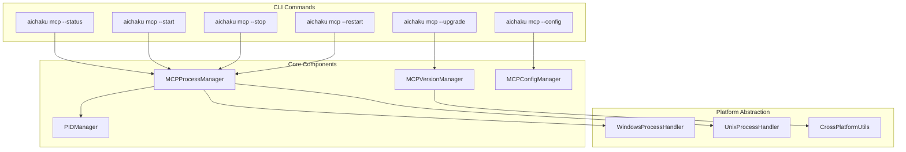

# MCP Server Management Implementation Design

## Architecture Overview



## Component Design

### 1. MCPProcessManager

```typescript
interface MCPProcessManager {
  // Core operations
  start(): Promise<ProcessResult>;
  stop(): Promise<ProcessResult>;
  restart(): Promise<ProcessResult>;
  status(): Promise<ProcessStatus>;

  // Helpers
  isRunning(): Promise<boolean>;
  getPID(): Promise<number | null>;
}

interface ProcessStatus {
  running: boolean;
  pid?: number;
  uptime?: string;
  version?: string;
  binaryPath: string;
  lastError?: string;
}

interface ProcessResult {
  success: boolean;
  message: string;
  pid?: number;
}
```

### 2. MCPVersionManager

```typescript
interface MCPVersionManager {
  getCurrentVersion(): Promise<string>;
  getLatestVersion(): Promise<string>;
  checkForUpdates(): Promise<VersionInfo>;
  upgrade(): Promise<UpgradeResult>;
}

interface VersionInfo {
  current: string;
  latest: string;
  updateAvailable: boolean;
  releaseNotes?: string;
  downloadUrl?: string;
}

interface UpgradeResult {
  success: boolean;
  previousVersion: string;
  newVersion: string;
  message: string;
}
```

### 3. PIDManager

```typescript
interface PIDManager {
  writePID(pid: number): Promise<void>;
  readPID(): Promise<number | null>;
  removePID(): Promise<void>;
  lockPID(): Promise<boolean>;
  isProcessRunning(pid: number): Promise<boolean>;
}
```

### 4. Platform Handlers

```typescript
interface ProcessHandler {
  start(binaryPath: string, args: string[]): Promise<ProcessInfo>;
  stop(pid: number): Promise<boolean>;
  isRunning(pid: number): Promise<boolean>;
  getProcessInfo(pid: number): Promise<ProcessDetails | null>;
}

interface ProcessInfo {
  pid: number;
  startTime: Date;
}

interface ProcessDetails {
  pid: number;
  name: string;
  startTime: Date;
  memoryUsage?: number;
  cpuUsage?: number;
}
```

## File Structure

```
src/
├── commands/
│   └── mcp.ts                    # Enhanced MCP command
├── utils/
│   ├── mcp/
│   │   ├── process-manager.ts    # Main process management
│   │   ├── version-manager.ts    # Version checking/upgrading
│   │   ├── config-manager.ts     # Configuration help
│   │   ├── pid-manager.ts        # PID file management
│   │   └── platform/
│   │       ├── base.ts           # Base interfaces
│   │       ├── unix.ts           # Unix/Linux/macOS handler
│   │       └── windows.ts        # Windows handler
│   └── ...
```

## Implementation Details

### Cross-Platform Process Management

```typescript
// utils/mcp/platform/base.ts
export abstract class BasePlatformHandler {
  abstract startProcess(cmd: string, args: string[]): Promise<ProcessInfo>;
  abstract stopProcess(pid: number): Promise<boolean>;
  abstract isProcessRunning(pid: number): Promise<boolean>;

  // Common functionality
  protected async readProcessOutput(
    process: Deno.ChildProcess,
  ): Promise<string> {
    const decoder = new TextDecoder();
    const output = await process.output();
    return decoder.decode(output.stdout);
  }
}

// utils/mcp/platform/unix.ts
export class UnixPlatformHandler extends BasePlatformHandler {
  async isProcessRunning(pid: number): Promise<boolean> {
    try {
      const command = new Deno.Command("kill", {
        args: ["-0", pid.toString()],
        stdout: "piped",
        stderr: "piped",
      });

      const { success } = await command.output();
      return success;
    } catch {
      return false;
    }
  }

  async stopProcess(pid: number): Promise<boolean> {
    try {
      Deno.kill(pid, "SIGTERM");

      // Wait up to 5 seconds for graceful shutdown
      for (let i = 0; i < 50; i++) {
        if (!await this.isProcessRunning(pid)) {
          return true;
        }
        await new Promise((resolve) => setTimeout(resolve, 100));
      }

      // Force kill if still running
      Deno.kill(pid, "SIGKILL");
      return true;
    } catch {
      return false;
    }
  }
}

// utils/mcp/platform/windows.ts
export class WindowsPlatformHandler extends BasePlatformHandler {
  async isProcessRunning(pid: number): Promise<boolean> {
    const command = new Deno.Command("tasklist", {
      args: ["/FI", `PID eq ${pid}`, "/FO", "CSV", "/NH"],
      stdout: "piped",
      stderr: "piped",
    });

    const { stdout, success } = await command.output();
    if (!success) return false;

    const output = new TextDecoder().decode(stdout);
    return output.includes(pid.toString());
  }

  async stopProcess(pid: number): Promise<boolean> {
    const command = new Deno.Command("taskkill", {
      args: ["/PID", pid.toString(), "/F"],
      stdout: "piped",
      stderr: "piped",
    });

    const { success } = await command.output();
    return success;
  }
}
```

### Version Management

```typescript
// utils/mcp/version-manager.ts
export class MCPVersionManager {
  private readonly GITHUB_API =
    "https://api.github.com/repos/RickCogley/aichaku/releases/latest";
  private readonly VERSION_REGEX = /VERSION:\s*([0-9]+\.[0-9]+\.[0-9]+)/;

  async getCurrentVersion(): Promise<string> {
    const binaryPath = this.getBinaryPath();

    // Try to extract version from binary
    const command = new Deno.Command(binaryPath, {
      args: ["--version"],
      stdout: "piped",
      stderr: "piped",
    });

    try {
      const { stdout } = await command.output();
      const output = new TextDecoder().decode(stdout);
      const match = output.match(this.VERSION_REGEX);
      if (match) return match[1];
    } catch {
      // Fall back to embedded version
    }

    // Check if version is embedded in binary metadata
    return await this.getEmbeddedVersion(binaryPath);
  }

  async getLatestVersion(): Promise<string> {
    const response = await fetch(this.GITHUB_API);
    const data = await response.json();
    return data.tag_name.replace("v", "");
  }

  async upgrade(): Promise<UpgradeResult> {
    const current = await this.getCurrentVersion();
    const latest = await this.getLatestVersion();

    if (current === latest) {
      return {
        success: true,
        previousVersion: current,
        newVersion: latest,
        message: "Already running the latest version",
      };
    }

    // Download new version
    const downloadUrl = await this.getDownloadUrl(latest);
    const newBinary = await this.downloadBinary(downloadUrl);

    // Stop current process
    const processManager = new MCPProcessManager();
    await processManager.stop();

    // Replace binary
    await this.replaceBinary(newBinary);

    // Start new version
    await processManager.start();

    return {
      success: true,
      previousVersion: current,
      newVersion: latest,
      message: `Successfully upgraded from ${current} to ${latest}`,
    };
  }
}
```

### Enhanced Status Display

```typescript
// Enhanced status command output
async function displayStatus(status: ProcessStatus): Promise<void> {
  console.log("🔍 MCP Server Status");
  console.log("━".repeat(50));

  const versionManager = new MCPVersionManager();
  const current = await versionManager.getCurrentVersion();
  const latest = await versionManager.getLatestVersion();
  const updateAvailable = current !== latest;

  console.log(
    `📦 Version:        ${current}${
      updateAvailable ? ` (latest: ${latest} available)` : " (latest)"
    }`,
  );
  console.log(`📍 Location:       ${status.binaryPath}`);
  console.log(
    `${status.running ? "🟢" : "🔴"} Status:         ${
      status.running ? "Running" : "Stopped"
    }${status.pid ? ` (PID: ${status.pid})` : ""}`,
  );

  if (status.uptime) {
    console.log(`⏱️  Uptime:         ${status.uptime}`);
  }

  console.log(`🔧 Platform:       ${Deno.build.os} ${Deno.build.arch}`);

  if (updateAvailable) {
    console.log("\n💡 To upgrade: aichaku mcp --upgrade");
  }

  if (!status.running) {
    console.log("\n💡 To start: aichaku mcp --start");
  }
}
```

### Configuration Instructions

```typescript
// Enhanced config command output
function displayConfigInstructions(): void {
  const binaryPath = getMCPBinaryPath();
  const isWindows = Deno.build.os === "windows";

  console.log("📝 To configure Claude Code:\n");
  console.log("Run this command once per system:");
  console.log("─".repeat(70));

  if (isWindows) {
    console.log(`claude mcp add aichaku-reviewer --stdio -- "${binaryPath}"`);
  } else {
    console.log(`claude mcp add aichaku-reviewer --stdio -- ${binaryPath}`);
  }

  console.log("─".repeat(70));
  console.log("\n✅ This enables the MCP server for all your aichaku projects");
  console.log("💡 Restart Claude Code after making changes");
  console.log("\n📍 The MCP server provides:");
  console.log("   • Security scanning (OWASP Top 10)");
  console.log("   • Standards compliance checking");
  console.log("   • Methodology validation");
  console.log("   • TypeScript best practices");
  console.log("   • Educational feedback");
}
```

## Error Handling

```typescript
class MCPError extends Error {
  constructor(
    message: string,
    public readonly code: MCPErrorCode,
    public readonly details?: unknown,
  ) {
    super(message);
    this.name = "MCPError";
  }
}

enum MCPErrorCode {
  PROCESS_ALREADY_RUNNING = "PROCESS_ALREADY_RUNNING",
  PROCESS_NOT_RUNNING = "PROCESS_NOT_RUNNING",
  PERMISSION_DENIED = "PERMISSION_DENIED",
  BINARY_NOT_FOUND = "BINARY_NOT_FOUND",
  VERSION_CHECK_FAILED = "VERSION_CHECK_FAILED",
  UPGRADE_FAILED = "UPGRADE_FAILED",
  PLATFORM_NOT_SUPPORTED = "PLATFORM_NOT_SUPPORTED",
}

// Usage in commands
try {
  await processManager.start();
} catch (error) {
  if (error instanceof MCPError) {
    switch (error.code) {
      case MCPErrorCode.PROCESS_ALREADY_RUNNING:
        console.error("❌ MCP server is already running");
        console.error("💡 Use 'aichaku mcp --restart' to restart it");
        break;
      case MCPErrorCode.PERMISSION_DENIED:
        console.error("❌ Permission denied");
        console.error("💡 Make sure the binary is executable");
        break;
      default:
        console.error(`❌ ${error.message}`);
    }
  } else {
    console.error("❌ Unexpected error:", error);
  }
}
```

## Testing Strategy

1. **Unit Tests**: Test each component in isolation
2. **Integration Tests**: Test full command flows
3. **Platform Tests**: Test on Windows, macOS, Linux
4. **Edge Cases**:
   - Multiple start attempts
   - Killing hung processes
   - Upgrading while running
   - Missing binaries
   - Network failures during upgrade

## Migration Path

1. Keep existing commands working during transition
2. Add deprecation warnings to old JSON output
3. Update documentation gradually
4. Provide clear upgrade instructions
