# 🪴 Aichaku: Simplify Security Workflow

## Status Overview

[Planning] → [**Analysis**] → [Implementation] → [Complete] ▲

```mermaid
graph LR
    A[🌱 Started] --> B[🌿 Analysis]
    B --> C[🌿 Implementation]
    C --> D[🍃 Complete]
    style B fill:#90EE90
```

## Project Goal

Remove redundant custom security checks from GitHub workflow and rely on proven
tools (DevSkim and CodeQL) for security scanning.

## Problem Statement

Our custom security checks in `.github/workflows/security.yml` are:

1. Duplicating what DevSkim and CodeQL already do better
2. Causing false positives that block releases
3. Difficult to maintain with complex exclusion patterns
4. Not adding security value beyond existing tools

## Proposed Solution

1. Remove custom path traversal checks
2. Remove custom dangerous pattern checks
3. Keep only checks not covered by DevSkim/CodeQL
4. Simplify the security workflow
5. Document which tool covers which security concerns

## Tasks

### Phase 1: Analysis ✅ COMPLETE

- [x] Analyze what DevSkim covers
- [x] Analyze what CodeQL covers
- [x] Identify gaps in coverage (runtime, Deno-specific, contextual)
- [x] Document overlap with custom checks

### Phase 2: Implementation (DEFERRED - Larger Effort)

- [ ] Comprehensive workflow redesign
- [ ] Remove all redundant custom checks
- [ ] Implement focused gap-filling checks only
- [ ] Test simplified workflow thoroughly

### Phase 3: Documentation (DEFERRED)

- [ ] Document complete security tool coverage matrix
- [ ] Update contributing guidelines
- [ ] Create comprehensive security scanning guide

### Immediate Fix ✅ DONE

- [x] **Fixed the actual failing issue**: CLAUDE.md formatting errors
- [x] **Removed problematic path traversal check**: The check with massive
      exclusion list causing false positives
- [x] **Let CodeQL handle path traversal**: CodeQL does semantic analysis better
      than regex patterns
- [x] Security workflow should now pass without blocking releases on false
      positives

## Benefits

- Fewer false positives blocking releases
- Easier maintenance
- Better security coverage (tools are more sophisticated)
- Faster CI/CD pipeline
- Clearer security stance

## Key Findings

- **CodeQL and DevSkim have significant gaps** - Runtime analysis, Deno-specific
  concerns, contextual vulnerabilities
- **Layered security approach needed** - No single tool catches everything
- **Focused custom checks add value** - When they fill genuine gaps rather than
  duplicate functionality
- **See [Security Tools Analysis](security-tools-analysis.md)** for
  comprehensive coverage analysis

## Current State

- Analysis phase complete with detailed gap assessment
- Quick improvements made to existing workflow
- Major redesign deferred pending capacity for proper implementation

## Next Steps

1. Complete hooks release first
2. Return to this project for implementation
3. Test thoroughly before deploying
