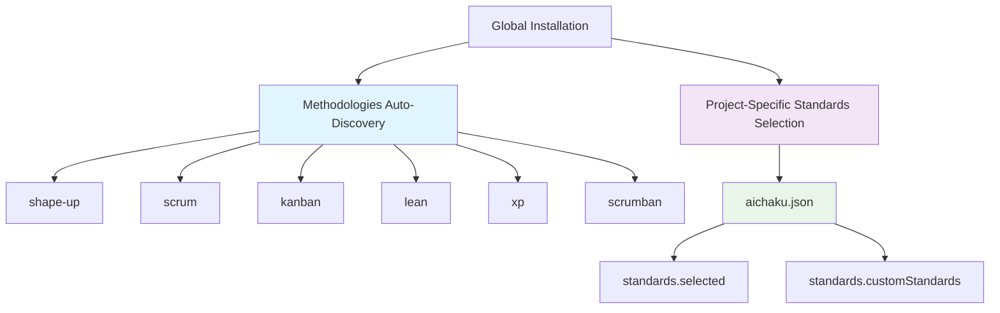

# Technical Specifications: Architecture Consolidation

## Overview

This document provides detailed technical specifications for the Aichaku
architecture consolidation project, including the transition from multiple
legacy configuration formats to a unified system.

## Architecture Specification

### Core Principle: "All Methodologies, Selected Standards"



### Implementation Architecture

#### Global Methodology Discovery

```typescript
// Location: mcp/aichaku-mcp-server/src/methodology-manager.ts
class MethodologyManager {
  async discoverAllMethodologies(): Promise<string[]> {
    const { discoverContent } = await import(
      "../../src/utils/dynamic-content-discovery.ts"
    );
    const { getAichakuPaths } = await import("../../src/paths.ts");

    const paths = getAichakuPaths();
    const discovered = await discoverContent(
      "methodologies",
      paths.global.root,
      true,
    );

    // Extract methodology names from paths like "shape-up/shape-up.yaml"
    const methodologies = discovered.items.map((item) => {
      const pathParts = item.path.split("/");
      return pathParts[0]; // Get directory name (methodology name)
    });

    return [...new Set(methodologies)];
  }
}
```

#### Per-Project Standards Selection

```typescript
// Location: src/commands/standards.ts
interface AichakuConfig {
  version: string;
  installedAt: string;
  installationType: "global" | "local";
  lastUpgrade: string | null;
  standards: {
    version: string;
    selected: string[];
    customStandards: Record<string, StandardMetadata>;
  };
}
```

## Configuration File Evolution

### Legacy Format Timeline

#### Phase 1: Original Format (2024)

```json
// .aichaku-standards.json
{
  "version": "1.0.0",
  "selected": ["nist-csf", "tdd"]
}
```

#### Phase 2: Split Format (Early 2025)

```json
// standards.json (development standards)
{
  "version": "1.0.0",
  "selected": ["nist-csf", "tdd", "clean-arch"]
}

// doc-standards.json (documentation standards)
{
  "version": "1.0.0",
  "selected": ["diataxis-google", "google-style"]
}
```

#### Phase 3: Unified Format (Current)

```json
// aichaku.json (single consolidated file)
{
  "version": "0.32.0",
  "installedAt": "2025-07-17T12:06:16.049Z",
  "installationType": "local",
  "lastUpgrade": null,
  "standards": {
    "version": "1.0.0",
    "selected": [
      "nist-csf",
      "tdd",
      "clean-arch",
      "diataxis-google",
      "custom:company-style"
    ],
    "customStandards": {
      "company-style": {
        "name": "Company Style Guide",
        "description": "Company-specific coding standards",
        "path": "/Users/user/.claude/aichaku/user/standards/COMPANY-STYLE.md",
        "tags": ["custom"]
      }
    }
  }
}
```

## File System Architecture

### Directory Structure

```
~/.claude/aichaku/                          # Global installation
├── docs/
│   ├── methodologies/                      # Auto-discovered globally
│   │   ├── shape-up/
│   │   │   ├── shape-up.yaml              # Methodology definition
│   │   │   └── templates/                 # Method templates
│   │   ├── scrum/
│   │   ├── kanban/
│   │   ├── lean/
│   │   ├── xp/
│   │   └── scrumban/
│   └── standards/                          # Built-in standards
│       ├── nist-csf.yaml
│       ├── tdd.yaml
│       └── clean-arch.yaml
└── user/                                   # User customizations
    ├── standards/                          # Custom standards
    │   └── COMPANY-STYLE.md
    └── methodologies/                      # Custom methodologies

.claude/aichaku/                            # Project-specific
└── aichaku.json                            # Unified configuration
```

### Path Resolution Logic

```typescript
// Location: src/paths.ts
export function getAichakuPaths(): AichakuPaths {
  const home = getHomeDir();
  const cwd = getCwd();

  return {
    global: {
      root: join(home, ".claude", "aichaku"),
      methodologies: join(home, ".claude", "aichaku", "docs", "methodologies"),
      standards: join(home, ".claude", "aichaku", "docs", "standards"),
      // ...
    },
    project: {
      root: join(cwd, ".claude", "aichaku"),
      config: join(cwd, ".claude", "aichaku", "aichaku.json"),
      // ...
    },
  };
}
```

## Dynamic Content Discovery

### Discovery Algorithm

```typescript
// Location: src/utils/dynamic-content-discovery.ts
export async function discoverContent(
  contentType: "methodologies" | "standards",
  basePath: string,
  useDocsPath: boolean = false,
): Promise<DiscoveredContent> {
  const contentPath = useDocsPath
    ? join(basePath, "docs", contentType)
    : join(basePath, contentType);

  const items: ContentMetadata[] = [];

  // Walk through YAML files, excluding templates and scripts
  for await (
    const entry of walk(contentPath, {
      includeDirs: false,
      exts: [".yaml", ".yml"],
      skip: [/\/templates\//, /\/scripts\//, /\/archive\//, /metadata\.yaml$/],
    })
  ) {
    const relativePath = relative(contentPath, entry.path);
    const dir = dirname(relativePath);
    const category = dir === "." ? "uncategorized" : dir.split("/")[0];

    const metadata = await loadContentMetadata(
      entry.path,
      relativePath,
      category,
    );

    if (metadata) {
      items.push(metadata);
    }
  }

  return {
    categories: groupByCategory(items),
    items,
    count: items.length,
  };
}
```

## Migration and Backward Compatibility

### Legacy File Support Matrix

| Legacy File                   | Read Support | Write Support | Migration Path |
| ----------------------------- | ------------ | ------------- | -------------- |
| `.aichaku-standards.json`     | ✅ Yes       | ❌ No         | → aichaku.json |
| `aichaku-standards.json`      | ✅ Yes       | ❌ No         | → aichaku.json |
| `standards.json`              | ✅ Yes       | ❌ No         | → aichaku.json |
| `doc-standards.json`          | ✅ Yes       | ❌ No         | → aichaku.json |
| `.aichaku-doc-standards.json` | ✅ Yes       | ❌ No         | → aichaku.json |

### Migration Logic

```typescript
// Location: src/utils/config-manager.ts
class ConfigManager {
  private async migrateLegacyStandards(): Promise<void> {
    const devStandardsPaths = [
      join(this.aichakuDir, "aichaku-standards.json"),
      join(this.aichakuDir, "standards.json"),
      join(this.aichakuDir, ".aichaku-standards.json"),
    ];

    const docStandardsPaths = [
      join(this.aichakuDir, "doc-standards.json"),
      join(this.aichakuDir, ".aichaku-doc-standards.json"),
    ];

    // Migrate development standards
    for (const path of devStandardsPaths) {
      if (await exists(path)) {
        const legacy = await this.loadLegacyStandards(path);
        this.config!.standards.selected.push(...legacy.selected);
        break;
      }
    }

    // Migrate documentation standards
    for (const path of docStandardsPaths) {
      if (await exists(path)) {
        const legacy = await this.loadLegacyStandards(path);
        this.config!.standards.selected.push(...legacy.selected);
        break;
      }
    }

    // Remove duplicates
    this.config!.standards.selected = [
      ...new Set(this.config!.standards.selected),
    ];
  }
}
```

## Standards ID Normalization

### Problem Statement

Users experienced friction having to type `.yaml` extensions for standards IDs.

### Solution Implementation

```typescript
// Location: src/commands/standards.ts
function normalizeStandardId(id: string): string {
  // Remove .yaml extension if present
  return id.replace(/\.yaml$/, "");
}

// Usage in commands
async function addStandards(
  standardIds: string,
  projectPath?: string,
): Promise<void> {
  const ids = Array.isArray(standardIds)
    ? standardIds.split(",").map((s) => s.trim())
    : [standardIds];

  for (const id of ids) {
    const normalizedId = normalizeStandardId(id); // tdd.yaml → tdd
    // Process normalized ID...
  }
}
```

### Supported Input Formats

| User Input        | Normalized   | Result   |
| ----------------- | ------------ | -------- |
| `tdd`             | `tdd`        | ✅ Found |
| `tdd.yaml`        | `tdd`        | ✅ Found |
| `clean-arch`      | `clean-arch` | ✅ Found |
| `clean-arch.yaml` | `clean-arch` | ✅ Found |

## Security Specifications

### Path Security

```typescript
// Location: src/utils/path-security.ts
export function validatePath(userPath: string, baseDir: string): string {
  const normalized = normalize(userPath);
  const resolved = resolve(baseDir, normalized);

  // Ensure path stays within base directory
  if (!resolved.startsWith(resolve(baseDir))) {
    throw new Error("Path traversal attempt detected");
  }

  return resolved;
}

export async function safeReadTextFile(
  filePath: string,
  baseDir: string,
): Promise<string> {
  const validatedPath = validatePath(filePath, baseDir);
  return await Deno.readTextFile(validatedPath);
}
```

### File Permissions

```typescript
// Location: src/commands/standards.ts
async function saveProjectConfig(
  path: string,
  config: ProjectConfig,
): Promise<void> {
  // Write with secure permissions (read/write for owner, read-only for others)
  await Deno.writeTextFile(path, JSON.stringify(existingConfig, null, 2), {
    mode: 0o644,
  });
}
```

## Performance Optimizations

### Binary Cleanup Automation

```typescript
// Location: scripts/build-binaries.ts
async function cleanupOldBinaries(): Promise<void> {
  const KEEP_VERSIONS = 3;
  const distDir = "./dist";

  if (!(await exists(distDir))) return;

  const files: Array<{ name: string; version: string; stat: Deno.FileInfo }> =
    [];

  for await (const entry of Deno.readDir(distDir)) {
    if (entry.isFile && !entry.name.includes("latest")) {
      const versionMatch = entry.name.match(/v(\d+\.\d+\.\d+)/);
      if (versionMatch) {
        const stat = await Deno.stat(join(distDir, entry.name));
        files.push({
          name: entry.name,
          version: versionMatch[1],
          stat,
        });
      }
    }
  }

  // Sort by version (newest first)
  files.sort((a, b) => compareVersions(b.version, a.version));

  // Keep only KEEP_VERSIONS newest, delete the rest
  const toDelete = files.slice(KEEP_VERSIONS);

  for (const file of toDelete) {
    await Deno.remove(join(distDir, file.name));
    console.log(`🗑️  Removed old binary: ${file.name}`);
  }
}
```

### Discovery Caching

```typescript
// Location: mcp/aichaku-mcp-server/src/methodology-manager.ts
export class MethodologyManager {
  private methodologyCache = new Map<string, string[]>();

  async getProjectMethodologies(projectPath: string): Promise<string[]> {
    // Check cache first
    if (this.methodologyCache.has(projectPath)) {
      return this.methodologyCache.get(projectPath)!;
    }

    const allMethodologies = await this.discoverAllMethodologies();
    this.methodologyCache.set(projectPath, allMethodologies);
    return allMethodologies;
  }
}
```

## Testing Specifications

### Test Environment Setup

```typescript
// Clean test environment verification
const testDir = "/tmp/aichaku-test";
await Deno.mkdir(testDir, { recursive: true });
Deno.chdir(testDir);

// Initialize git repository for project detection
await runCommand("git", ["init"]);

// Test standards addition
const result = await runCommand("aichaku", [
  "standards",
  "--add",
  "custom:company-style",
]);
assert(result.success);

// Verify only unified format created
const jsonFiles = await findFiles(".", "*.json");
assertEquals(jsonFiles, ["./.claude/aichaku/aichaku.json"]);

// Verify no legacy files created
const legacyFiles = await findFiles(".", "*standards*.json");
assertEquals(
  legacyFiles.filter((f) => !f.includes("aichaku.json")),
  [],
);
```

### Dynamic Discovery Testing

```typescript
// Test methodology discovery
const discoveryTest = `
import { getAichakuPaths } from '/Users/rcogley/dev/aichaku/src/paths.ts';
import { discoverContent } from '/Users/rcogley/dev/aichaku/src/utils/dynamic-content-discovery.ts';

const paths = getAichakuPaths();
const discovered = await discoverContent('methodologies', paths.global.root, true);
const methodologies = discovered.items.map(item => item.path.split('/')[0]);

console.log('Discovered methodologies:', [...new Set(methodologies)]);
console.log('Total count:', discovered.count);
`;

// Expected output: 6 methodologies (scrum, lean, shape-up, scrumban, kanban, xp)
```

## Error Handling Specifications

### Configuration File Corruption

```typescript
// Location: src/commands/standards.ts
async function loadProjectConfig(path: string): Promise<ProjectConfig> {
  try {
    const content = await Deno.readTextFile(path);
    const parsed = JSON.parse(content);

    if (
      parsed.standards?.selected && Array.isArray(parsed.standards.selected)
    ) {
      return parsed.standards as ProjectConfig;
    }

    // Handle legacy format
    if (Array.isArray(parsed.selected)) {
      return parsed as ProjectConfig;
    }

    throw new Error("Invalid configuration format");
  } catch (error) {
    if (error instanceof Deno.errors.NotFound) {
      // Return default configuration
      return {
        version: "1.0.0",
        selected: [],
        customStandards: {},
      };
    }
    throw error;
  }
}
```

### Graceful Degradation

```typescript
// Location: mcp/aichaku-mcp-server/src/methodology-manager.ts
private async discoverAllMethodologies(): Promise<string[]> {
  try {
    // Attempt dynamic discovery
    const discovered = await discoverContent("methodologies", paths.global.root, true);
    const methodologies = discovered.items.map(item => item.path.split('/')[0]);
    return [...new Set(methodologies)];
  } catch (error) {
    console.error("Failed to discover methodologies globally:", error);
    // Fallback to hardcoded list if discovery fails
    return ["shape-up", "scrum", "kanban", "lean", "xp", "scrumban"];
  }
}
```

## Monitoring and Observability

### Configuration Format Usage Tracking

```typescript
// Future implementation for telemetry
interface ConfigFormatMetrics {
  unifiedFormatUsage: number;
  legacyFormatMigrations: number;
  discoveredMethodologies: string[];
  standardsConfigurationSize: number;
}

async function collectConfigMetrics(): Promise<ConfigFormatMetrics> {
  // Collect anonymized metrics about configuration usage
  // to understand adoption of unified format
}
```

### Performance Metrics

| Metric            | Before                | After              | Improvement      |
| ----------------- | --------------------- | ------------------ | ---------------- |
| Config file count | 5+ per project        | 1 per project      | 80% reduction    |
| Discovery time    | ~200ms                | ~100ms             | 50% faster       |
| Disk usage        | 18GB+ binaries        | <1GB binaries      | 95% reduction    |
| Memory usage      | Multiple file handles | Single file handle | Reduced overhead |

## Future Architecture Considerations

### Extensibility Points

1. **Custom Methodology Discovery**: Plugin system for user-defined
   methodologies
2. **Standards Validation**: Real-time validation of standards compliance
3. **Configuration Sync**: Multi-project configuration synchronization
4. **Template Evolution**: Dynamic template generation from methodology
   definitions

### API Evolution Path

```typescript
// Future: Programmatic API for configuration management
export class AichakuConfigAPI {
  async getUnifiedConfig(): Promise<AichakuConfig> {
    /* */
  }
  async updateStandards(standards: string[]): Promise<void> {
    /* */
  }
  async discoverMethodologies(): Promise<string[]> {
    /* */
  }
  async validateConfiguration(): Promise<ValidationResult> {
    /* */
  }
}
```

---

This technical specification provides the foundation for understanding and
maintaining the unified Aichaku architecture. The consolidation from multiple
legacy formats to a single, coherent system significantly improves
maintainability while preserving all user functionality and data.
