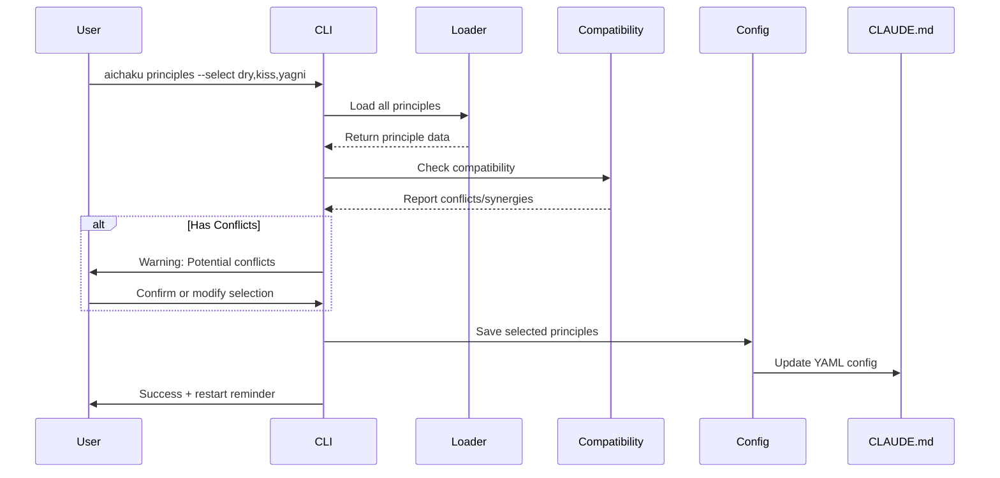

# Technical Design: Principles Guidance System

## Architecture Overview

The principles system extends aichaku's existing architecture to support guiding philosophies alongside methodologies
and standards.

```mermaid
graph TD
    A[CLI Interface<br/>aichaku principles] --> B[Principles Loader<br/>YAML → TypeScript]
    B --> C[Principle Selection<br/>Manager]
    C --> D[aichaku.json<br/>storage]
    C --> E[Agent Generator<br/>includes principles]
    
    B --> F[Principle<br/>Compatibility<br/>Checker]
    F --> C
    
    E --> G[CLAUDE.md<br/>Integration]
    
    style A fill:#e1f5fe
    style D fill:#fff3e0
    style G fill:#f3e5f5
```



## Data Structures

### Principle Interface

```typescript
interface Principle {
  // Metadata
  name: string;
  category: "software-development" | "organizational" | "engineering" | "human-centered";
  description: string;
  aliases?: string[]; // Alternative names

  // Historical Context
  history: {
    origin: string; // When and where it originated
    originators: string[]; // Key figures
    evolution: string; // How it has evolved
    significance: string; // Why it matters
  };

  // Core content
  summary: {
    tagline: string; // One-line summary
    core_tenets: Array<{
      text: string;
      guidance: string;
    }>;
    anti_patterns: Array<{
      pattern: string;
      instead: string;
    }>;
    key_practices?: string[];
  };

  // Guidance
  guidance: {
    spirit: string; // The underlying philosophy
    questions_to_ask: string[]; // Self-check questions
    when_to_apply: string[];
    exceptions: string[];
    common_mistakes: string[];
  };

  // Examples
  examples: {
    good: Array<{
      description: string;
      code?: string;
      explanation: string;
    }>;
    bad: Array<{
      description: string;
      code?: string;
      problem: string;
    }>;
    real_world: Array<{
      project: string;
      description: string;
      link?: string;
    }>;
  };

  // Compatibility
  compatibility: {
    works_well_with: string[];
    potential_conflicts: string[];
    complements: string[];
  };

  // References
  references: {
    foundational: string[]; // Original texts/papers
    modern: string[]; // Contemporary interpretations
    tools: string[]; // Tools that embody the principle
  };
}
```

### Configuration Extension

```typescript
// Extend existing AichakuConfig
interface AichakuConfig {
  // ... existing fields ...
  principles?: {
    selected: string[];
    // Future: customization options
  };
}
```

## File Organization

```
docs/
└── principles/
    ├── index.yaml                    # Principle registry
    ├── software-development/
    │   ├── unix-philosophy.yaml      # Structured data
    │   ├── unix-philosophy.md        # Human-readable guide
    │   ├── dry.yaml
    │   ├── dry.md
    │   ├── yagni.yaml
    │   ├── yagni.md
    │   ├── kiss.yaml
    │   ├── kiss.md
    │   ├── zen-of-python.yaml
    │   └── zen-of-python.md
    ├── organizational/
    │   ├── agile-manifesto.yaml
    │   ├── agile-manifesto.md
    │   ├── devops-three-ways.yaml
    │   ├── devops-three-ways.md
    │   ├── lean-principles.yaml
    │   ├── lean-principles.md
    │   ├── theory-of-constraints.yaml
    │   ├── theory-of-constraints.md
    │   ├── conways-law.yaml
    │   └── conways-law.md
    ├── engineering/
    │   ├── defensive-programming.yaml
    │   ├── defensive-programming.md
    │   ├── fail-fast.yaml
    │   ├── fail-fast.md
    │   ├── least-privilege.yaml
    │   ├── least-privilege.md
    │   ├── separation-of-concerns.yaml
    │   └── separation-of-concerns.md
    └── human-centered/
        ├── design-thinking.yaml
        ├── design-thinking.md
        ├── accessibility-first.yaml
        ├── accessibility-first.md
        ├── privacy-by-design.yaml
        └── privacy-by-design.md
```

### File Pairing Strategy

Each principle has two files:

- **`.yaml`** - Structured data for CLI and agent consumption
- **`.md`** - Rich documentation for GitHub browsing and learning

This matches the pattern used by methodologies and standards.

## Implementation Patterns

### Command Pattern (matches existing)

```typescript
// src/commands/principles.ts
export async function principles(args: string[]): Promise<void> {
  const flags = parseFlags(args);

  if (flags.list) {
    await listPrinciples(flags.category);
  } else if (flags.show) {
    await showPrinciple(flags.show, { verbose: flags.verbose });
  } else if (flags.select) {
    await selectPrinciples(flags.select.split(","));
  } else if (flags.selectInteractive) {
    await selectPrinciplesInteractive();
  } else if (flags.current) {
    await showCurrentPrinciples();
  } else if (flags.remove) {
    await removePrinciples(flags.remove.split(","));
  } else if (flags.clear) {
    await clearPrinciples();
  } else {
    showPrinciplesHelp();
  }
}
```

### Loader Pattern

```typescript
// src/utils/principles-loader.ts
export class PrinciplesLoader {
  private cache: Map<string, PrincipleWithDocs> = new Map();

  async loadAll(): Promise<PrincipleWithDocs[]> {
    const principlesPath = path.join(getAichakuPaths().global.root, "docs/principles");
    const principles: PrincipleWithDocs[] = [];

    for (const category of PRINCIPLE_CATEGORIES) {
      const categoryPath = path.join(principlesPath, category);
      const yamlFiles = await glob(`${categoryPath}/*.yaml`);

      for (const yamlFile of yamlFiles) {
        const principle = await this.loadPrincipleWithDocs(yamlFile);
        if (principle) {
          principles.push(principle);
          this.cache.set(principle.data.name, principle);
        }
      }
    }

    return principles;
  }

  private async loadPrincipleWithDocs(yamlPath: string): Promise<PrincipleWithDocs | null> {
    try {
      // Load YAML data
      const yamlContent = await Deno.readTextFile(yamlPath);
      const data = parse(yamlContent) as Principle;

      // Validate against schema
      if (!this.validatePrinciple(data)) {
        console.warn(`Invalid principle format: ${yamlPath}`);
        return null;
      }

      // Load corresponding Markdown documentation
      const mdPath = yamlPath.replace(".yaml", ".md");
      let documentation = "";

      try {
        documentation = await Deno.readTextFile(mdPath);
      } catch {
        console.warn(`Missing documentation for principle: ${mdPath}`);
        // Generate basic documentation from YAML data
        documentation = this.generateBasicDocs(data);
      }

      return {
        data,
        documentation,
        path: yamlPath,
      };
    } catch (error) {
      console.error(`Failed to load principle: ${yamlPath}`, error);
      return null;
    }
  }

  private generateBasicDocs(principle: Principle): string {
    // Fallback documentation generation from YAML data
    return `# ${principle.name}\n\n${principle.description}\n\n...`;
  }
}

interface PrincipleWithDocs {
  data: Principle;
  documentation: string;
  path: string;
}
```

## Agent Integration

### Principle-Aware Guidance

```typescript
// In agent-generator.ts
function generatePrincipleGuidance(selectedPrinciples: string[]): string {
  if (selectedPrinciples.length === 0) return "";

  return `
## Guiding Principles

You should be aware of these principles the user has selected:

${selectedPrinciples.map((p) => `- **${p}**: Apply this philosophy when making suggestions`).join("\n")}

When reviewing code or suggesting improvements:
- Consider if the approach aligns with these principles
- Suggest alternatives that better embody the principles
- Explain decisions in terms of principle alignment
- Be gentle and educational, not prescriptive
`;
}
```

## Migration Strategy

1. **No Breaking Changes**: Existing functionality remains unchanged
2. **Additive Only**: Principles are a new feature, not modifying existing
3. **Gradual Adoption**: Users can adopt principles at their own pace
4. **Future Proofing**: Design allows for future enhancements

## Performance Considerations

1. **Lazy Loading**: Load principles only when needed
2. **Caching**: Cache loaded principles in memory
3. **Parallel Loading**: Load all principle files concurrently
4. **Minimal Impact**: Don't slow down existing commands

## Error Handling

1. **Graceful Degradation**: Missing principles don't break the system
2. **Clear Messages**: User-friendly error messages
3. **Validation**: Validate YAML structure on load
4. **Recovery**: Allow partial principle loading if some fail

## Principle Selection Flow



## Compatibility Checking

### Implementation

```typescript
// src/utils/principle-compatibility.ts
export class PrincipleCompatibilityChecker {
  constructor(private principles: Map<string, Principle>) {}

  checkCompatibility(selectedPrinciples: string[]): CompatibilityReport {
    const conflicts: Array<[string, string, string]> = [];
    const synergies: Array<[string, string]> = [];

    for (let i = 0; i < selectedPrinciples.length; i++) {
      for (let j = i + 1; j < selectedPrinciples.length; j++) {
        const p1 = this.principles.get(selectedPrinciples[i]);
        const p2 = this.principles.get(selectedPrinciples[j]);

        if (!p1 || !p2) continue;

        // Check for conflicts
        if (p1.compatibility.potential_conflicts.includes(p2.name)) {
          conflicts.push([p1.name, p2.name, "May have conflicting approaches"]);
        }

        // Check for synergies
        if (p1.compatibility.works_well_with.includes(p2.name)) {
          synergies.push([p1.name, p2.name]);
        }
      }
    }

    return { conflicts, synergies, score: this.calculateScore(conflicts, synergies) };
  }

  visualizeMatrix(principles: string[]): string {
    // Generate compatibility matrix for display
    // Returns formatted string with symbols: ✓ = works well, ✗ = conflicts, - = neutral
  }
}
```

### Compatibility Matrix Visualization

```mermaid
graph LR
    subgraph "Principle Compatibility Matrix"
        A[unix-philosophy] -.->|✓| B[kiss]
        A -.->|✓| C[yagni]
        A -.->|✗| D[enterprise-patterns]
        B -.->|✓| C
        B -.->|✓| E[dry]
        C -.->|✓| E
        D -.->|✗| C
        
        style A fill:#e8f5e9
        style B fill:#e8f5e9
        style C fill:#e8f5e9
        style D fill:#ffebee
        style E fill:#e8f5e9
    end
```



## Branding and UI Consistency

### Visual Identity Requirements

All principle commands must maintain aichaku's established branding using the `printFormatted` utility:

```typescript
import { printFormatted } from "../utils/terminal-formatter.ts";

// Example: principles --list output
function listPrinciples(category?: string): void {
  const content = [`# 🌸 Aichaku Principles - Guiding Philosophies\n`];

  if (category) {
    content.push(`Showing principles for category: **${category}**\n`);
  } else {
    content.push(`Select from ${principleCount} timeless principles to guide your development.\n`);
  }

  // Categories with consistent emoji usage
  content.push(`## 💻 Software Development\n`);
  content.push(`- **Unix Philosophy** - Do one thing well\n`);
  content.push(`- **DRY** - Don't Repeat Yourself\n`);

  content.push(`## 🏢 Organizational\n`);
  content.push(`- **Agile Manifesto** - Individuals over processes\n`);

  printFormatted(content.join(""));
}
```

### Command Output Patterns

Follow these patterns for consistent branding:

```typescript
// Success messages
printFormatted(`✅ Selected ${count} principles for your project.`);

// Info messages
printFormatted(`📚 Showing details for principle: **${name}**`);

// Warning messages
printFormatted(`⚠️  Warning: Potential conflicts detected between principles.`);

// Error messages
printFormatted(`❌ Error: Principle '${name}' not found.`);
```

### Branding Elements

1. **Header Format**: Always start with emoji + "Aichaku Principles" + description
2. **Category Emojis**:
   - 💻 Software Development
   - 🏢 Organizational
   - ⚙️ Engineering
   - 👥 Human-Centered
3. **Status Indicators**:
   - ✅ Success/Selected
   - ❌ Error/Conflict
   - ⚠️ Warning
   - 📚 Information
   - 🎯 Current selection
4. **Formatting**:
   - Bold for emphasis: `**principle-name**`
   - Code blocks for examples
   - Consistent spacing and structure

### Integration with Existing Commands

The principles command should feel like a natural extension of existing commands:

```bash
# Consistent with existing patterns
aichaku methodologies --list    # 🪴 Aichaku Methodologies
aichaku standards --list        # 📐 Aichaku Standards  
aichaku principles --list       # 🌸 Aichaku Principles
```

## Future Extensions

1. **Custom Principles**: Allow users to define their own
2. **Principle Profiles**: Pre-selected sets for different contexts
3. **Advanced Conflict Resolution**: Suggest alternatives when conflicts detected
4. **Metrics**: Track which principles are most used/helpful
5. **Principle Evolution**: Track how principles are interpreted over time
