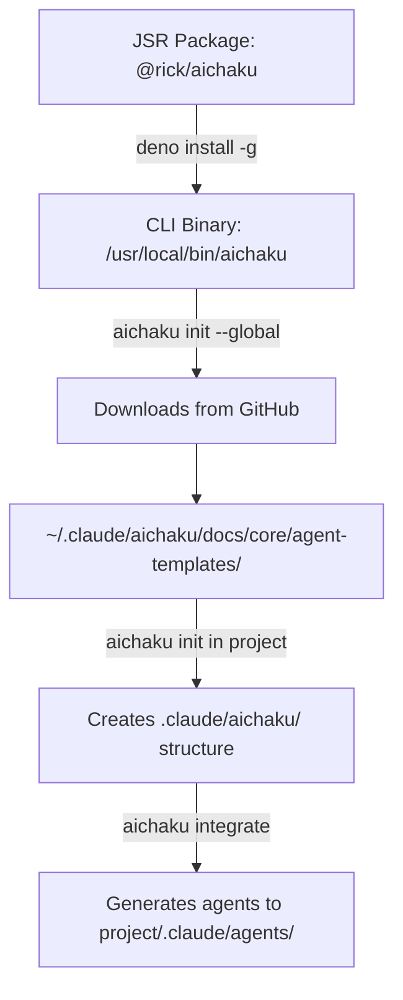
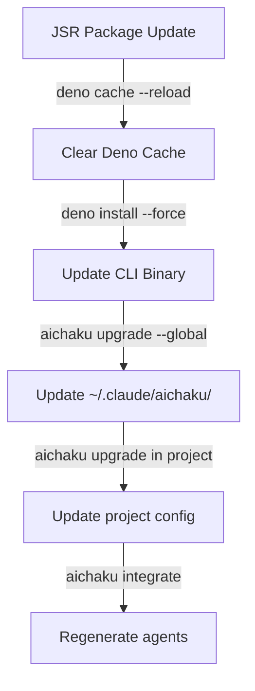

# Agent Template Flow - Complete Journey

## Overview

Agent templates flow from JSR/GitHub → Global Installation → Project Integration

## Step-by-Step Flow

### First Time Installation



1. **Install CLI from JSR**
   ```bash
   deno install -g -A -n aichaku jsr:@rick/aichaku/cli
   ```
   - Downloads the CLI code from JSR
   - Creates executable at `/usr/local/bin/aichaku` (or similar)

2. **Initialize Global Installation**
   ```bash
   aichaku init --global
   ```
   - Downloads agent templates from GitHub to `~/.claude/aichaku/docs/core/agent-templates/`
   - Each agent has its own folder with `base.md` file
   - These are the SOURCE templates (unmodified)

3. **Initialize Project**
   ```bash
   cd /path/to/project
   aichaku init
   ```
   - Creates `.claude/aichaku/` structure in project
   - Does NOT copy agents yet
   - Creates `aichaku.json` config file

4. **Integrate (Generate Agents)**
   ```bash
   aichaku integrate
   ```
   - Reads templates from `~/.claude/aichaku/docs/core/agent-templates/`
   - Generates customized agents based on:
     - Selected methodologies
     - Selected standards
     - Selected principles
   - Writes to `project/.claude/agents/aichaku-*.md`

### Upgrade Flow



1. **Update CLI**
   ```bash
   deno cache --reload jsr:@rick/aichaku/cli
   deno install -g -A -n aichaku --force jsr:@rick/aichaku/cli
   ```
   - Clears Deno's module cache
   - Forces reinstall of latest version

2. **Update Global Content**
   ```bash
   aichaku upgrade --global
   ```
   - Downloads latest agent templates from GitHub
   - Overwrites `~/.claude/aichaku/docs/core/agent-templates/`
   - Shows: "🤖 Updated 20 Aichaku agents"

3. **Update Project**
   ```bash
   cd /path/to/project
   aichaku upgrade
   ```
   - Updates project's `aichaku.json` if needed
   - Does NOT automatically regenerate agents

4. **Regenerate Agents**
   ```bash
   aichaku integrate
   ```
   - Re-reads templates from updated `~/.claude/aichaku/docs/core/agent-templates/`
   - Regenerates agents with latest templates + current selections
   - Overwrites `project/.claude/agents/aichaku-*.md`

## Key Directories

### Global Installation

```
~/.claude/aichaku/
├── docs/
│   ├── core/
│   │   ├── agent-templates/      # SOURCE templates (from GitHub)
│   │   │   ├── deno-expert/
│   │   │   │   └── base.md       # Template with YAML frontmatter
│   │   │   ├── test-expert/
│   │   │   │   └── base.md
│   │   │   └── ...
│   │   └── ...
│   ├── methodologies/
│   └── standards/
└── aichaku.json                   # Global config
```

### Project Structure

```
project/
├── .claude/
│   ├── agents/                    # GENERATED agents (customized)
│   │   ├── aichaku-deno-expert.md
│   │   ├── aichaku-test-expert.md
│   │   └── ...
│   └── aichaku/
│       ├── aichaku.json           # Project config
│       └── user/                  # User customizations
└── CLAUDE.md                      # Updated by integrate
```

## Agent Customization Process

When `aichaku integrate` runs:

1. **Load Template**: Reads from `~/.claude/aichaku/docs/core/agent-templates/{agent}/base.md`

2. **Extract Metadata**: Parses YAML frontmatter:
   ```yaml
   ---
   name: aichaku-deno-expert
   type: optional
   description: Deno runtime specialist
   tools: ["Read", "Write", "Edit"]
   ---
   ```

3. **Inject Context**: Adds sections based on selections:
   - Selected methodologies (e.g., Shape Up)
   - Selected standards (e.g., TDD, OWASP)
   - Selected principles (e.g., DRY, KISS)

4. **Generate Output**: Writes customized agent to `project/.claude/agents/aichaku-{agent}.md`

## Important Notes

1. **Templates are never modified** - The source templates in `~/.claude/aichaku/docs/core/agent-templates/` are
   read-only references

2. **Agents are regenerated** - Running `aichaku integrate` completely regenerates agents based on current selections

3. **Context injection is dynamic** - Agents get different context based on what methodologies/standards/principles are
   selected

4. **Default vs Optional agents**:
   - Default agents: Always generated (if type: default in template)
   - Optional agents: Only generated if explicitly selected with `aichaku agents --add`

5. **Agent IDs are namespaced** - All agents use `aichaku-` prefix to prevent collisions with user's custom agents

## Verification Commands

```bash
# Check global templates exist
ls ~/.claude/aichaku/docs/core/agent-templates/

# Check project agents after integrate
ls .claude/agents/aichaku-*.md

# View an agent template (source)
cat ~/.claude/aichaku/docs/core/agent-templates/deno-expert/base.md

# View a generated agent (customized)
cat .claude/agents/aichaku-deno-expert.md
```

## Summary

- **Source**: GitHub → `~/.claude/aichaku/docs/core/agent-templates/`
- **Generation**: Templates + Context → `project/.claude/agents/`
- **Updates**: `upgrade --global` updates templates, `integrate` regenerates agents
- **Customization**: Based on selected methodologies, standards, and principles
