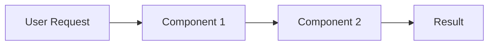

# Microsoft Writing Style Guide

## Quick Reference

The Microsoft Writing Style Guide promotes clear, consistent, and accessible technical documentation with a warm,
approachable tone. It emphasizes inclusivity, global readability, and user empowerment.

### Core Principles

1. **🌍 Global-ready** - Write for international audiences
2. **♿ Accessible** - Design for all abilities and contexts
3. **🤝 Inclusive** - Welcome everyone with bias-free language
4. **💡 Clear** - Prioritize clarity over cleverness
5. **🚀 Empowering** - Help users succeed and feel confident

## Tutorial Guidelines

### Purpose

Help users learn by doing, building confidence through successful completion of tasks.

### Structure

Microsoft tutorials follow a hands-on, step-by-step approach with clear outcomes and encouraging tone.

See the complete template: [`templates/tutorial-template.md`](./templates/tutorial-template.md)

Key structural elements:
- **Time estimate** upfront  
- **Prerequisites** section
- **Numbered steps** with clear actions
- **Encouragement** after each achievement  
- **What you learned** summary
- **Try this next** section for continued learning

### Microsoft Style Notes for Tutorials

- **Use "you" and active voice**: "You create a function" not "A function is created"
- **Be encouraging**: Use "Great!" or "Nice work!" to celebrate progress
- **Explain the why**: Help users understand the purpose, not just the steps
- **Use friendly contractions**: "you'll", "let's", "it's"
- **Include tips and notes**: Help users avoid common pitfalls

## How-to Guide Guidelines

### Purpose
Provide focused, task-oriented guidance for users who know what they want to accomplish.

### Structure
```markdown
# [Action verb] [specific task]

This article explains how to [task]. Use this approach when you want to [scenario].

**In this article**
- [Prerequisites](#prerequisites)
- [Main task](#main-task)
- [Verify results](#verify-results)
- [Clean up resources](#clean-up-resources)

## Prerequisites

- [Specific requirement with version]
- [Permission or access needed]
- Complete [prerequisite task](link) if you haven't already

## [Main task]

Choose the method that works best for your scenario:

### Use the [interface name]

The easiest way to [task] is through the [interface].

1. Go to the [location] in the [interface].

2. Find your [resource] in the list.

   > [!NOTE]
   > If you don't see your [resource], make sure you selected the correct [filter/scope].

3. Select **[Action]** > **[Specific option]**.

4. Configure these settings:

   | Setting | Value | Description |
   |---------|--------|-------------|
   | **Name** | *Your choice* | A descriptive name for [purpose] |
   | **Type** | *Standard* | For most scenarios, use Standard |
   | **Size** | *Medium* | Balance between performance and cost |

5. Select **Review + create**.

6. Review your settings, then select **Create**.

### Use the command line

If you prefer working from the command line, or need to automate this task:

```bash
# Set your variables
RESOURCE_NAME="your-resource-name"
LOCATION="eastus"

# Create the resource
az resource create \
  --name $RESOURCE_NAME \
  --location $LOCATION \
  --type Standard \
  --size Medium
````

> [!IMPORTANT]
> Replace the example values with your actual values. The location must be a valid Azure region.

## Verify results

Make sure your [task] completed successfully:

1. Go to the [location] to view your new [resource].

2. Check that the status shows as *Ready* or *Active*.

3. Test the [resource] by [specific test action].

If something doesn't look right, see [Troubleshoot common issues](#troubleshooting).

## Clean up resources

To avoid unnecessary charges, remove resources you no longer need:

> [!WARNING]
> This permanently deletes your [resource] and all associated data.

1. Select your [resource].
2. Select **Delete**.
3. Type the resource name to confirm.
4. Select **Delete**.

## Troubleshooting

### [Resource] not appearing

- Wait 2-3 minutes and refresh the page
- Check you're in the correct [scope/filter]
- Verify you have permission to view [resources]

### Creation fails with error "[specific error]"

This usually means [explanation]. To fix it:

1. [Solution step 1]
2. [Solution step 2]

## Next steps

- [Learn about advanced features](link)
- [Configure security settings](link)
- [Set up monitoring](link)

````
### Microsoft Style Notes for How-to Guides

- **Front-load important information**: Put key details early
- **Offer multiple methods**: GUI and command line when applicable
- **Use descriptive headings**: "Configure security settings" not just "Security"
- **Include cleanup**: Help users manage resources and costs
- **Add troubleshooting**: Address common problems proactively

## Reference Guidelines

### Purpose
Provide complete, accurate technical information for users who need specific details.

### Structure
```markdown
# [Component/Command] reference

## [Component/Command name]

[Brief description of purpose and common use cases]

### Syntax
````

command-name [--option] <required-argument> [optional-argument]

````
### Parameters

#### `<required-argument>`

*Required*. [Description of the argument and its purpose].

- **Type**: String | Integer | Boolean
- **Valid values**: [List specific values or describe format]
- **Default**: None (required)

**Examples**:
```bash
command-name "example-value"
command-name 123
````

#### `[optional-argument]`

*Optional*. [Description and when to use it].

- **Type**: String
- **Valid values**: [List or describe]
- **Default**: `default-value`

### Options

#### `--option`, `-o`

[Description of what this option does].

- **Type**: String
- **Valid values**: `value1` | `value2` | `value3`
- **Default**: `value1`
- **Required**: No

**Example**:

```bash
command-name --option value2 my-argument
```

#### `--verbose`, `-v`

Increase logging verbosity. Use up to three times for more detail.

**Example**:

```bash
command-name -vvv my-argument  # Maximum verbosity
```

### Examples

#### Basic usage

Create a simple [thing]:

```bash
command-name my-thing
```

Output:

```
Created [thing] 'my-thing' successfully.
ID: 12345
Status: Active
```

#### Advanced usage

Create a [thing] with custom configuration:

```bash
command-name my-advanced-thing \
  --option value2 \
  --config ./custom.json \
  --timeout 300
```

### Return values

| Code | Meaning            | Details                                         |
| ---- | ------------------ | ----------------------------------------------- |
| 0    | Success            | Operation completed without errors              |
| 1    | General failure    | Check error message for details                 |
| 2    | Invalid arguments  | Review command syntax                           |
| 3    | Resource not found | Verify the resource name and permissions        |
| 4    | Timeout            | Operation took too long; try increasing timeout |

### Related commands

- [`related-command`](link) - Brief description of relationship
- [`another-command`](link) - How it works with this command

### See also

- [Conceptual overview of [topic]](link)
- [How to use [command] in common scenarios](link)
- [Best practices for [component]](link)

````
### Microsoft Style Notes for References

- **Be scannable**: Use consistent formatting and clear sections
- **Include all parameters**: Document every option, even deprecated ones
- **Show real examples**: Include actual output where helpful
- **Explain relationships**: How commands and options work together
- **Keep current**: Update for each version change

## Explanation Guidelines

### Purpose
Help users understand concepts, architecture, and the reasoning behind design decisions.

### Structure
```markdown
# Understand [concept/technology]

[Engaging introduction that explains why this topic matters to the reader]

**In this article**
- [What is [concept]?](#what-is-concept)
- [How it works](#how-it-works)
- [When to use it](#when-to-use-it)
- [Best practices](#best-practices)

## What is [concept]?

[Clear, simple definition followed by a relatable analogy if helpful]

Think of [concept] like [familiar analogy]. Just as [analogy explanation], [concept] helps you [benefit/purpose].

### Key benefits

- **[Benefit 1]**: [How it helps users]
- **[Benefit 2]**: [Specific advantage]
- **[Benefit 3]**: [Business or technical value]

## How it works

[High-level explanation using diagrams where helpful]



Let's break this down:

1. **User Request**: When you [action], the system [what happens].

2. **Processing**: The [component] takes your request and [explanation].

3. **Result**: You get [outcome], which you can use to [purpose].

### Under the hood

For those interested in the technical details:

[Deeper technical explanation with specific implementation details]

## When to use it

[Concept] works best when:

- ✅ You need to [scenario 1]
- ✅ Your application requires [requirement]
- ✅ You want to [goal]

Consider alternatives when:

- ❌ Your use case involves [conflicting scenario]
- ❌ You need [different requirement]
- ❌ Performance is critical for [specific operation]

## Compare with similar approaches

| Approach            | Best for          | Limitations           |
| ------------------- | ----------------- | --------------------- |
| **[This concept]**  | [Use cases]       | [Tradeoffs]           |
| **[Alternative 1]** | [Different cases] | [Different tradeoffs] |
| **[Alternative 2]** | [Other cases]     | [Other tradeoffs]     |

## Best practices

Follow these guidelines to get the most from [concept]:

### Do

- ✅ [Specific recommended action]
- ✅ [Another good practice]
- ✅ [Performance tip]

### Don't

- ❌ [Common mistake to avoid]
- ❌ [Anti-pattern]
- ❌ [Security risk to avoid]

## Example scenario

Let's see how [concept] works in practice:

*Contoso Corporation needs to [business need]. They implement [concept] to:*

- *[Specific goal 1]*
- *[Specific goal 2]*

Here's how they did it: [Concrete example with code/configuration if applicable]

## What's next?

Now that you understand [concept], you're ready to:

- [Try the hands-on tutorial](link) - Build something real
- [Explore advanced features](link) - Go deeper
- [Read the API reference](link) - See all the options

````
### Microsoft Style Notes for Explanations

- **Start with value**: Why should readers care about this topic?
- **Use progressive disclosure**: Start simple, add complexity gradually
- **Include diagrams**: Visual aids help explain complex concepts
- **Provide concrete examples**: Abstract concepts need real scenarios
- **Connect to user goals**: Always relate back to what users want to achieve

## General Microsoft Style Guidelines

### Voice and Tone

#### Be Warm and Approachable
- ✅ "Let's explore how to..."
- ✅ "You might wonder why..."
- ✅ "Here's a tip that can save you time"
- ❌ "Users must configure..."
- ❌ "It should be noted that..."

#### Empower Users
- ✅ "You can customize this to fit your needs"
- ✅ "Choose the option that works best for you"
- ❌ "You must follow these steps exactly"
- ❌ "Failure to do this will result in errors"

### Accessibility Guidelines

#### Structure
- Use descriptive headings that stand alone
- Keep paragraphs short (3-4 sentences)
- Use lists to break up complex information
- Provide alt text for all images

#### Language
- Define acronyms on first use: "Artificial Intelligence (AI)"
- Avoid directional language: "Select **Next**" not "Click the button on the right"
- Use device-agnostic terms: "select" not "click", "enter" not "type"

### Inclusive Language

#### Use Bias-Free Language
- ✅ "They" as singular pronoun
- ✅ "Primary/replica" not "master/slave"
- ✅ "Allowlist/blocklist" not "whitelist/blacklist"
- ✅ "Placeholder text" not "dummy text"

#### Global Audience
- Avoid idioms: "straightforward" not "piece of cake"
- Use global examples: varied names, locations, scenarios
- Specify formats: "MM/DD/YYYY" not just "date"
- Include timezone: "2 PM PST (UTC-8)"

### Formatting Standards

#### Alerts and Notices

```markdown
> [!NOTE]
> Additional information that helps users succeed.

> [!TIP]
> Optional advice to improve the experience.

> [!IMPORTANT]
> Essential information users need to know.

> [!WARNING]
> Critical information to prevent problems.

> [!CAUTION]
> Serious consequences if ignored.
````

#### UI Elements

- **Bold** for UI elements: "Select **File** > **Save**"
- *Italics* for user input: "In the **Name** box, enter *MyProject*"
- `Code` formatting for code elements, files, and values

#### Tables

Use tables for:

- Comparing options
- Listing parameters
- Showing settings and values

Keep tables simple and scannable.

### Content Types

#### Quickstarts

- 5-10 minute completion time
- Minimal prerequisites
- One clear outcome
- Links to next steps

#### Concepts

- Explain the why before the how
- Use analogies sparingly and carefully
- Include diagrams for complex topics
- Connect to practical applications

#### Troubleshooting

- Problem-solution format
- Most common issues first
- Clear error messages as headings
- Specific resolution steps

## Documentation Planning

Before writing, consider:

1. **Audience**: Who needs this information?
2. **Purpose**: What will they do with it?
3. **Context**: When will they need it?
4. **Format**: What type of document serves them best?

Remember: Good documentation anticipates user needs and removes barriers to success. Write with empathy, clarity, and
respect for your readers' time and expertise.
