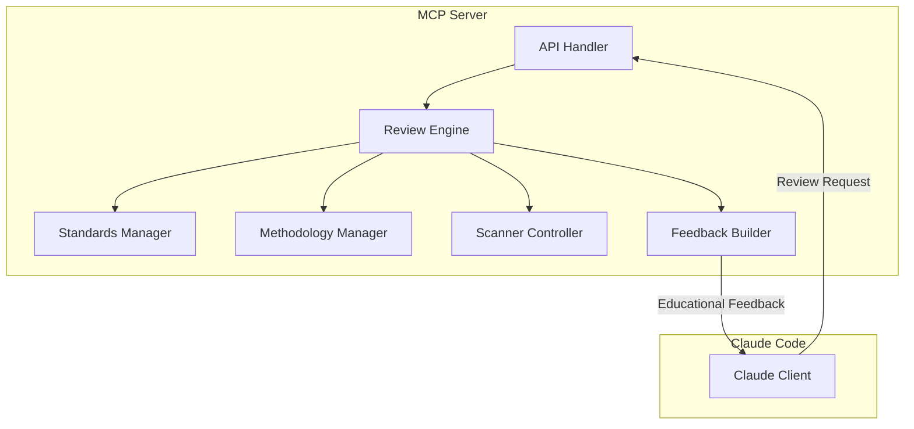

# 🪴 Aichaku MCP Code Reviewer

An MCP (Model Context Protocol) server that provides automated security and
standards review for Claude Code, based on Aichaku methodologies and standards.

## Features

- **Security Scanning**: Built-in patterns for OWASP Top 10 vulnerabilities
- **Standards Compliance**: Checks against selected standards (15-Factor, TDD,
  etc.)
- **Methodology Validation**: Ensures adherence to Shape Up, Scrum, Kanban
  practices
- **TypeScript Support**: Specific checks for TypeScript best practices
- **Educational Feedback**: Provides learning opportunities, not just criticism
- **External Tool Integration**: Supports CodeQL, DevSkim, Semgrep (if
  installed)
- **Privacy-First**: All scanning happens locally, no code leaves your machine

## Installation

### Prerequisites

- Deno 2.0 or higher
- Claude Code with MCP support

### Quick Start

1. Clone or install the MCP server:

```bash
# From Aichaku repository
cd mcp-server
deno task compile

# Or install globally
deno install -A -n mcp-code-reviewer https://raw.githubusercontent.com/RickCogley/aichaku/main/mcp-server/src/server.ts
```

2. Configure Claude Code to use the MCP server:

```json
// In Claude's MCP configuration
{
  "mcpServers": {
    "aichaku-reviewer": {
      "command": "mcp-code-reviewer",
      "args": [],
      "env": {}
    }
  }
}
```

## Usage

Once configured, the MCP server provides these tools to Claude:

### `review_file`

Reviews a file for security, standards, and methodology compliance.

```typescript
// Claude can use:
await mcp.review_file({
  file: "/path/to/file.ts",
  includeExternal: true, // Use external scanners if available
});
```

### `review_methodology`

Checks if the project follows selected methodology patterns.

```typescript
await mcp.review_methodology({
  projectPath: "/path/to/project",
  methodology: "shape-up", // or "scrum", "kanban", etc.
});
```

### `get_standards`

Gets the currently selected standards for a project.

```typescript
await mcp.get_standards({
  projectPath: "/path/to/project",
});
```

## Security Patterns

The MCP checks for common security vulnerabilities including:

- **Command Injection** (OWASP A03)
- **Path Traversal** (OWASP A01)
- **SQL Injection** (OWASP A03)
- **Hardcoded Secrets** (OWASP A02)
- **Broken Access Control** (OWASP A01)
- **Security Misconfiguration** (OWASP A05)

## Educational Feedback

When issues are found, the MCP provides comprehensive guidance:

```
🌱 Learning Opportunity - Let's fix this properly:

📖 Context: Command injection is one of the most critical security vulnerabilities...

⚠️ Issue: Using shell variables directly in commands
📌 Reminder: Your CLAUDE.md requires preventing command injection

❌ Bad Example:
bash -c "echo $USER_INPUT"

✅ Good Example:
bash -c 'echo "$1"' -- "$USER_INPUT"

🔄 Step-by-Step Fix:
1. Identify all shell command executions
2. Replace string interpolation with parameter expansion
...

🤔 Reflection: What made you use string interpolation?

📌 Note to self: Always use parameter expansion for shell commands.
```

## Configuration

The MCP reads configuration from:

1. **Project Standards**: `.claude/.aichaku-standards.json`
2. **Methodologies**: Detected from project structure
3. **External Tools**: Auto-detected from PATH

### Example Project Configuration

```json
{
  "version": "1.0.0",
  "selected": ["owasp-web", "15-factor", "tdd"],
  "methodologies": ["shape-up"]
}
```

## Development

### Running Locally

```bash
# Development mode with watch
deno task dev

# Run tests
deno task test

# Type check
deno task check
```

### Building

```bash
# Build for current platform
deno task compile

# Build for all platforms
deno task compile:all
```

## Architecture



## Privacy & Security

- **100% Local**: All scanning happens on your machine
- **No Network Calls**: No code or results are sent anywhere
- **No Analytics**: We don't track usage or collect data
- **Open Source**: Audit the code yourself

## Contributing

Contributions are welcome! Please:

1. Follow the existing code style
2. Add tests for new patterns
3. Update documentation
4. Ensure security patterns are accurate

## License

MIT License - Same as Aichaku

## Support

- Issues: [GitHub Issues](https://github.com/RickCogley/aichaku/issues)
- Documentation: [Aichaku Docs](https://github.com/RickCogley/aichaku)

---

Built with 🪴 by the Aichaku team
