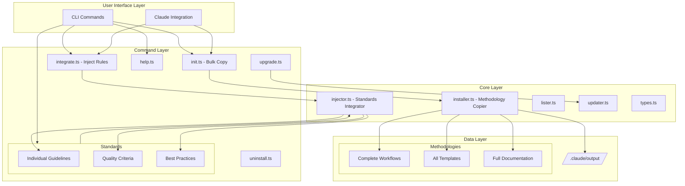
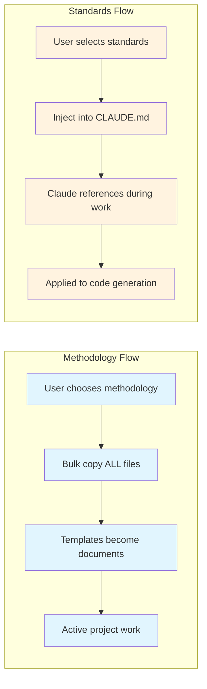
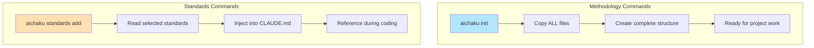
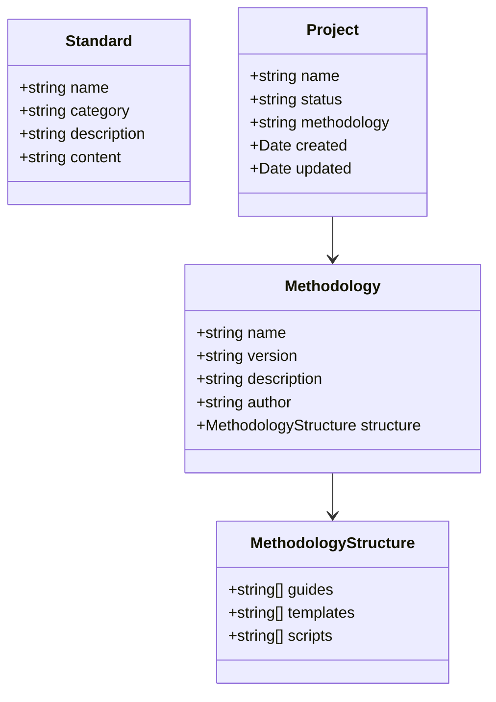
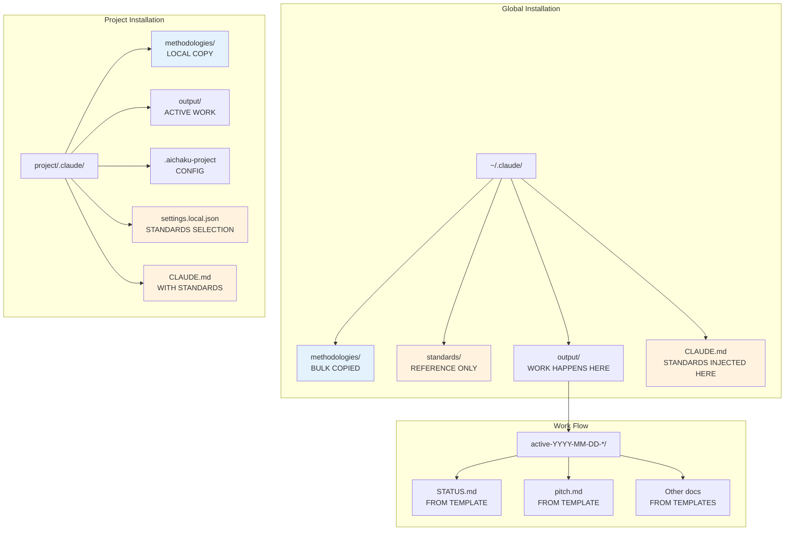
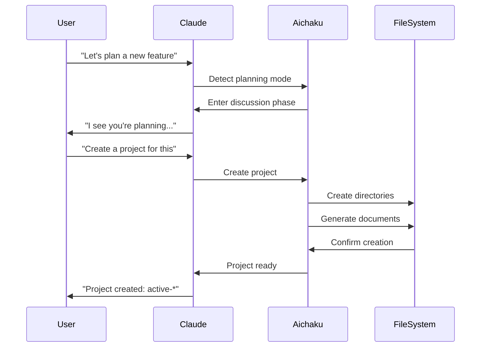
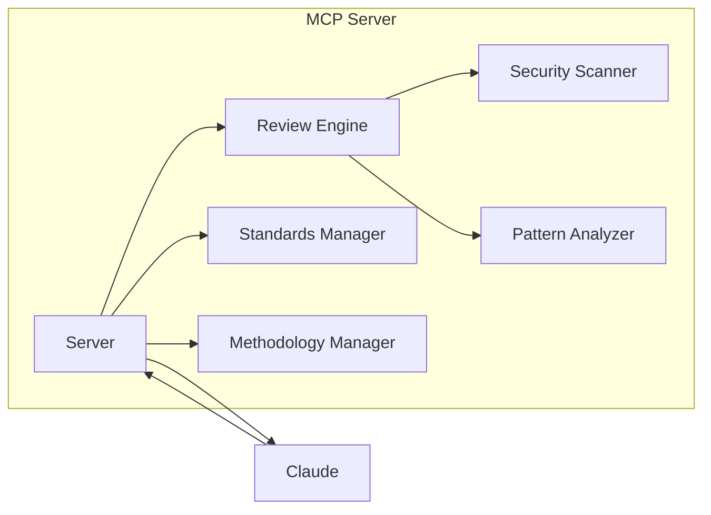
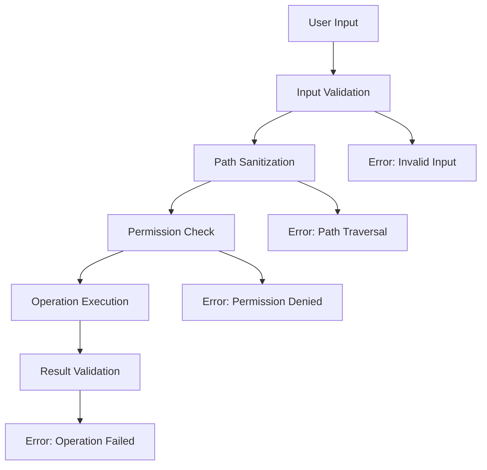
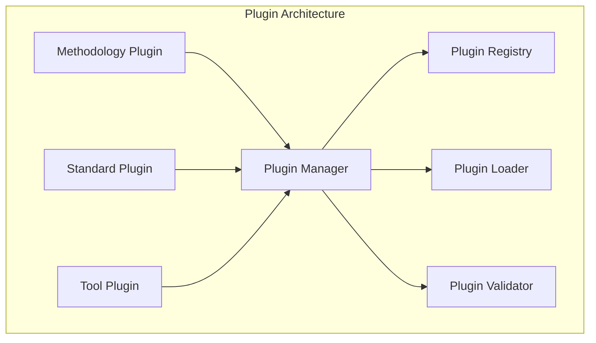
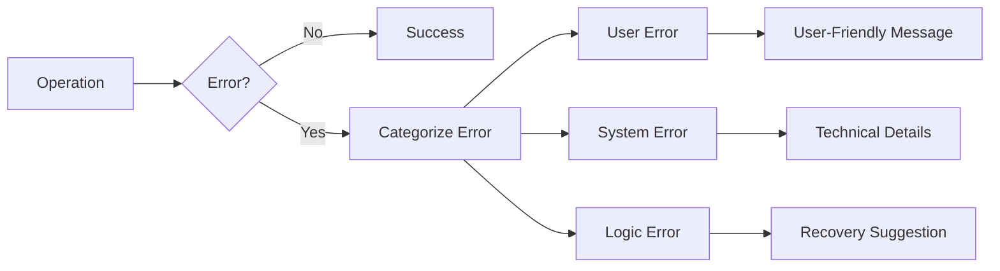

# Aichaku Architecture

## System Overview

Aichaku is designed with a clear philosophical distinction between **methodologies** (ways of working) and **standards** (quality guidelines). This architecture reflects the fundamental difference in how these resources are used and integrated.



## Philosophical Architecture

### Core Distinction: Methodologies vs Standards

Aichaku's architecture is built on a fundamental philosophical distinction:

#### Methodologies (How We Work)
- **Complete Workflows**: Shape Up, Scrum, Kanban, etc.
- **Bulk Installation**: All or nothing - you adopt a complete methodology
- **Living Documents**: Templates that become active project artifacts
- **Project-Specific**: Each project follows ONE primary methodology

#### Standards (How We Code)
- **Quality Guidelines**: OWASP, TDD, SOLID, etc.
- **Selective Integration**: Pick and choose what applies
- **Reference Material**: Guidelines that inform but don't replace work
- **Universal Application**: Multiple standards can apply simultaneously

### Architectural Implications



### File System Philosophy

The directory structure reflects this philosophical divide:

```
.claude/
├── methodologies/          # Complete, self-contained workflows
│   ├── shape-up/          # ALL Shape Up materials
│   │   ├── guides/        # How to do Shape Up
│   │   ├── templates/     # Becomes your actual docs
│   │   └── scripts/       # Supporting tools
│   └── scrum/            # ALL Scrum materials
│       └── ...           # Complete package
│
├── standards/            # À la carte quality guidelines  
│   ├── security/         # Individual security standards
│   │   ├── OWASP.md     # One standard, one file
│   │   └── NIST-CSF.md  # Referenced, not copied
│   └── development/      # Individual dev practices
│       ├── TDD.md       # Standalone guideline
│       └── SOLID.md     # Applied during coding
│
└── output/              # Where methodologies create work
    └── active-*/        # Methodology templates in action
```

## Component Architecture

### 1. Entry Points

#### CLI Entry (`cli.ts`)
- Main command-line interface
- Parses arguments and routes to appropriate commands
- Handles global flags (--help, --version)
- Provides user-friendly error messages

#### Library Entry (`mod.ts`)
- Exports public API for programmatic use
- Provides TypeScript types
- Enables integration with other tools

### 2. Command Layer

Commands are architected to reflect the methodology/standards distinction:

#### Methodology Commands (Bulk Operations)

**init**: Initialize Aichaku with COMPLETE methodology installation
```typescript
interface InitOptions {
  projectPath?: string;
  global?: boolean;
  force?: boolean;
  dryRun?: boolean;
  silent?: boolean;
}

// Behavior: Copies ENTIRE methodology structure
// Philosophy: You're adopting a complete way of working
```

**integrate**: Inject Aichaku RULES into CLAUDE.md
```typescript
interface IntegrateOptions {
  projectPath?: string;
  force?: boolean;
  dryRun?: boolean;
  silent?: boolean;
}

// Behavior: Injects behavioral rules, NOT content
// Philosophy: Teaches Claude HOW to use methodologies
```

#### Standards Commands (Selective Operations)

**standards**: Manage coding standards À LA CARTE
```typescript
interface StandardsOptions {
  list?: boolean;
  add?: string[];      // Selectively add standards
  remove?: string[];   // Selectively remove standards
  show?: string;       // View individual standard
  categories?: string[];
  projectPath?: string;
}

// Behavior: Pick and choose individual standards
// Philosophy: Build your own quality criteria set
```

#### Command Architecture Differences



### 3. Core Services

#### Installer Service
- Copies methodology files to target location
- Creates directory structure
- Handles symlink vs copy operations
- Validates installations

#### Lister Service
- Discovers available methodologies
- Lists installed methodologies
- Provides metadata about each

#### Updater Service
- Checks for updates
- Applies updates safely
- Preserves user customizations

### 4. Data Model



## File System Architecture

### Installation Philosophy

The file system architecture embodies the methodology/standards distinction:



### Directory Structure with Purpose

```
aichaku/                    # This repository
├── cli.ts                 # CLI entry point
├── mod.ts                 # Library entry point
├── src/
│   ├── commands/         
│   │   ├── init.ts       # BULK COPIES methodologies
│   │   ├── integrate.ts  # INJECTS Aichaku rules
│   │   ├── standards.ts  # SELECTIVELY adds standards
│   │   └── ...
│   ├── installer.ts      # Handles BULK operations
│   ├── injector.ts       # Handles SELECTIVE operations
│   └── ...
│
├── methodologies/         # COMPLETE WORKFLOWS (bulk copied)
│   ├── core/             # Universal behaviors
│   ├── shape-up/         # Everything for Shape Up
│   │   ├── SHAPE-UP-AICHAKU-GUIDE.md
│   │   ├── templates/    # Become your actual docs
│   │   │   ├── pitch.md
│   │   │   ├── cycle-plan.md
│   │   │   └── cool-down.md
│   │   └── scripts/      # Supporting tools
│   ├── scrum/            # Everything for Scrum
│   │   ├── SCRUM-AICHAKU-GUIDE.md
│   │   ├── templates/
│   │   │   ├── sprint-planning.md
│   │   │   ├── daily-standup.md
│   │   │   └── retrospective.md
│   │   └── scripts/
│   └── ...               # Other complete methodologies
│
├── standards/            # QUALITY GUIDELINES (selectively added)
│   ├── architecture/     # Architectural patterns
│   │   ├── CLEAN.md     # One pattern per file
│   │   ├── DDD.md       # Referenced, not copied
│   │   └── HEXAGONAL.md # Injected on demand
│   ├── development/      # Dev practices
│   │   ├── TDD.md       # Test-driven development
│   │   ├── SOLID.md     # SOLID principles
│   │   └── DRY.md       # Don't repeat yourself
│   ├── security/         # Security standards
│   │   ├── OWASP.md     # OWASP Top 10
│   │   └── NIST-CSF.md  # NIST framework
│   └── testing/          # Testing approaches
│       ├── TEST-PYRAMID.md
│       └── BDD.md
│
└── mcp-server/          # MCP integration
```

### User's Project Structure

```
myproject/
├── .claude/
│   ├── methodologies/    # BULK COPIED from aichaku
│   │   └── shape-up/     # Complete Shape Up package
│   │       └── ...       # All files copied
│   │
│   ├── output/           # WHERE WORK HAPPENS
│   │   ├── active-2025-07-10-new-feature/
│   │   │   ├── STATUS.md # Created from template
│   │   │   ├── pitch.md  # Created from template
│   │   │   └── ...       # Your actual work
│   │   └── done-2025-07-09-bug-fix/
│   │       └── ...       # Completed work
│   │
│   ├── CLAUDE.md         # Contains INJECTED standards
│   ├── .aichaku-project  # Marks this as Aichaku project
│   └── settings.local.json # Your selected standards
│
└── [your actual code]
```

## Integration Architecture

### Claude Integration Flow



### MCP Server Architecture

The Model Context Protocol (MCP) server provides:
- Real-time code analysis
- Security scanning
- Standards compliance checking
- Methodology adherence validation



## Security Architecture

### Principle of Least Privilege

1. **File System Access**
   - Only write to designated directories
   - Validate all paths before operations
   - No execution of user-provided code

2. **No Network Operations**
   - Completely offline operation
   - No external dependencies
   - No data collection

3. **Safe Defaults**
   - Conservative file permissions
   - Explicit user confirmation for destructive operations
   - Dry-run mode for all commands

### Security Layers



## Extension Architecture

### Adding New Methodologies

1. Create directory in `/methodologies/`
2. Add `[METHODOLOGY]-AICHAKU-GUIDE.md`
3. Create `/templates/` subdirectory
4. Add templates for each phase
5. Update methodology registry

### Adding New Standards

1. Choose appropriate category
2. Create markdown file in category directory
3. Follow standard template format
4. Include examples and anti-patterns

### Plugin System (Future)



## Performance Considerations

### Optimization Strategies

1. **Lazy Loading**
   - Load methodologies on demand
   - Cache frequently accessed files
   - Minimize startup time

2. **Efficient File Operations**
   - Batch file operations
   - Use streams for large files
   - Async/await for non-blocking I/O

3. **Memory Management**
   - Clear caches periodically
   - Limit in-memory data structures
   - Stream large outputs

## Error Handling Architecture

### Error Categories

1. **User Errors**
   - Invalid input
   - Missing permissions
   - Incorrect usage

2. **System Errors**
   - File system failures
   - Permission issues
   - Resource constraints

3. **Logic Errors**
   - Validation failures
   - Consistency issues
   - State conflicts

### Error Flow



## Testing Architecture

### Test Layers

1. **Unit Tests**
   - Individual function testing
   - Mock dependencies
   - Fast execution

2. **Integration Tests**
   - Command flow testing
   - File system operations
   - Real methodology files

3. **End-to-End Tests**
   - Full workflow scenarios
   - Claude integration simulation
   - Output validation

### Test Organization

```
tests/
├── unit/
│   ├── commands/
│   ├── services/
│   └── utils/
├── integration/
│   ├── workflows/
│   └── file-operations/
└── e2e/
    ├── scenarios/
    └── claude-integration/
```

## Architectural Decisions

### ADR-001: Methodology Bulk Copy vs Standards Injection

**Context**: How should Aichaku handle the fundamental difference between complete workflows (methodologies) and quality guidelines (standards)?

**Decision**: 
- Methodologies are **bulk-copied** in their entirety
- Standards are **selectively injected** into CLAUDE.md

**Rationale**:
1. **Methodologies are holistic** - You can't do "half of Scrum"
2. **Standards are modular** - You can apply TDD without SOLID
3. **Templates need to exist** - Methodology templates become actual work
4. **Guidelines inform work** - Standards guide but don't create artifacts

**Consequences**:
- (+) Clear mental model for users
- (+) Appropriate tool for each use case  
- (+) Preserves methodology integrity
- (-) Duplicate files if using multiple methodologies
- (-) More complex command structure

### ADR-002: File System over Database

**Context**: Should Aichaku use a database or file system for storage?

**Decision**: Use file system exclusively

**Rationale**:
1. **Transparency** - Users can see/edit all files
2. **Git-friendly** - Everything is versionable
3. **No dependencies** - Works everywhere Deno works
4. **Claude-compatible** - AI can read/write files directly

**Consequences**:
- (+) Simple, transparent operation
- (+) No database management overhead
- (+) Excellent debugging experience
- (-) No complex queries
- (-) Manual organization required

### ADR-003: Standards in CLAUDE.md vs Separate Files

**Context**: Where should selected standards be stored for Claude's reference?

**Decision**: Inject standards content directly into CLAUDE.md

**Rationale**:
1. **Single source of truth** - Claude reads one file
2. **Performance** - No multiple file reads during coding
3. **Customization** - Users can edit injected content
4. **Visibility** - Clear what standards are active

**Consequences**:
- (+) Fast Claude performance
- (+) User control over content
- (+) Clear active standards
- (-) Larger CLAUDE.md files
- (-) Potential sync issues with source

### ADR-004: Opinionated Directory Structure

**Context**: Should Aichaku enforce its directory structure or be flexible?

**Decision**: Enforce the `.claude/` directory structure

**Rationale**:
1. **Predictability** - Claude always knows where to look
2. **Separation** - Clear boundary from project code
3. **Standards** - Consistent across all projects
4. **Automation** - Scripts can rely on structure

**Consequences**:
- (+) Consistent experience
- (+) Reliable automation
- (+) Clear organization
- (-) Less flexibility
- (-) May conflict with some project structures

## Future Architecture Considerations

### Planned Enhancements

1. **Plugin System**
   - Dynamic methodology loading
   - Custom command extensions
   - Third-party integrations

2. **Web Interface**
   - Project dashboard
   - Visual methodology selection
   - Progress tracking

3. **Team Features**
   - Shared project states
   - Collaboration tools
   - Synchronization

4. **Analytics**
   - Usage patterns
   - Methodology effectiveness
   - Team productivity metrics

### Scalability Considerations

- Modular design allows independent scaling
- Stateless operations enable horizontal scaling
- File-based storage supports distributed teams
- Clear interfaces enable future refactoring