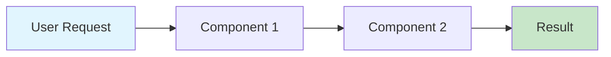
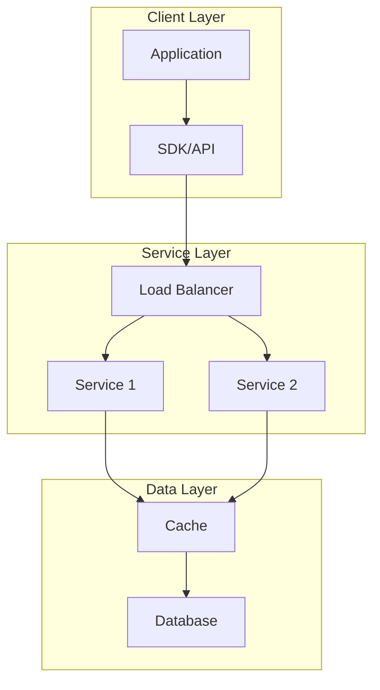

# Understand [concept/technology]

[Engaging introduction that explains why this topic matters to the reader]

**In this article**

- [What is [concept]?](#what-is-concept)
- [How it works](#how-it-works)
- [When to use it](#when-to-use-it)
- [Architecture](#architecture)
- [Best practices](#best-practices)
- [Common scenarios](#common-scenarios)

## What is [concept]?

[Clear, simple definition followed by a relatable analogy if helpful]

Think of [concept] like [familiar analogy]. Just as [analogy explanation],
[concept] helps you [benefit/purpose].

### Key benefits

- **[Benefit 1]**: [How it helps users]
- **[Benefit 2]**: [Specific advantage]
- **[Benefit 3]**: [Business or technical value]

### Core components

[Concept] consists of these main parts:

- **[Component 1]**: [What it does]
- **[Component 2]**: [What it does]
- **[Component 3]**: [What it does]

## How it works

[High-level explanation using diagrams where helpful]



Let's break this down:

1. **User Request**: When you [action], the system [what happens].

2. **Processing**: The [component] takes your request and [explanation].

3. **Result**: You get [outcome], which you can use to [purpose].

### Under the hood

For those interested in the technical details:

[Deeper technical explanation with specific implementation details]

> [!NOTE]
> You don't need to understand these internals to use [concept] effectively.
> This information is for those who want to optimize performance or troubleshoot
> complex issues.

## When to use it

[Concept] works best when:

- ✅ You need to [scenario 1]
- ✅ Your application requires [requirement]
- ✅ You want to [goal]
- ✅ Performance is important for [use case]

Consider alternatives when:

- ❌ Your use case involves [conflicting scenario]
- ❌ You need [different requirement]
- ❌ Simplicity is more important than [trade-off]
- ❌ You're working with [incompatible technology]

## Architecture

### High-level architecture



### Component details

#### [Component 1]

**Purpose**: [What it does and why]

**Responsibilities**:

- [Responsibility 1]
- [Responsibility 2]
- [Responsibility 3]

**Key features**:

- [Feature 1]
- [Feature 2]

## Best practices

Follow these guidelines to get the most from [concept]:

### Design recommendations

#### Do

- ✅ [Specific recommended action]
- ✅ [Another good practice]
- ✅ [Performance tip]

#### Don't

- ❌ [Common mistake to avoid]
- ❌ [Anti-pattern]
- ❌ [Security risk to avoid]

### Performance optimization

To get the best performance:

1. **[Optimization 1]**: [How and why]
2. **[Optimization 2]**: [How and why]
3. **[Optimization 3]**: [How and why]

### Security considerations

Keep these security aspects in mind:

- **Authentication**: Always [security practice]
- **Authorization**: Implement [security practice]
- **Data protection**: Ensure [security practice]

> [!IMPORTANT]
> Never [specific security risk]. This could [consequence].

## Common scenarios

### Scenario 1: [Business scenario]

_Contoso Corporation needs to [business need]. They implement [concept] to:_

- _[Specific goal 1]_
- _[Specific goal 2]_

**Solution approach**:

1. [Step 1]
2. [Step 2]
3. [Step 3]

**Results**:

- [Quantified benefit 1]
- [Quantified benefit 2]

### Scenario 2: [Technical scenario]

_A development team wants to [technical goal]. They use [concept] because:_

- _[Reason 1]_
- _[Reason 2]_

**Implementation**:

```code
// Example implementation
[Relevant code showing the scenario]
```

## Compare with similar approaches

| Aspect             | [This concept]    | [Alternative 1]   | [Alternative 2]   |
| ------------------ | ----------------- | ----------------- | ----------------- |
| **Use case**       | [Best for]        | [Best for]        | [Best for]        |
| **Performance**    | [Characteristics] | [Characteristics] | [Characteristics] |
| **Complexity**     | [Level]           | [Level]           | [Level]           |
| **Cost**           | [Relative cost]   | [Relative cost]   | [Relative cost]   |
| **Learning curve** | [Difficulty]      | [Difficulty]      | [Difficulty]      |

### When to choose [concept]

Choose [concept] when:

- Your priority is [specific need]
- You need [specific capability]
- Your team is comfortable with [specific requirement]

### When to consider alternatives

Look at alternatives when:

- You need [different priority]
- Your constraints include [specific limitation]
- You're already using [conflicting technology]

## Frequently asked questions

### Can I use [concept] with [technology]?

Yes, [concept] integrates well with [technology]. See [integration guide](link)
for details.

### How does [concept] handle [concern]?

[Concept] addresses [concern] by [explanation]. This ensures [benefit].

### What's the difference between [concept] and [similar concept]?

While both [similarity], [concept] focuses on [difference 1], whereas [similar
concept] emphasizes [difference 2].

## What's next?

Now that you understand [concept], you're ready to:

- [Try the hands-on tutorial](link) - Build something real
- [Explore advanced features](link) - Go deeper
- [Read the API reference](link) - See all the options
- [Join the community](link) - Connect with other users

## Additional resources

- 📖 [Official documentation](link)
- 🎥 [Video walkthrough](link)
- 💬 [Community forum](link)
- 📊 [Case studies](link)
